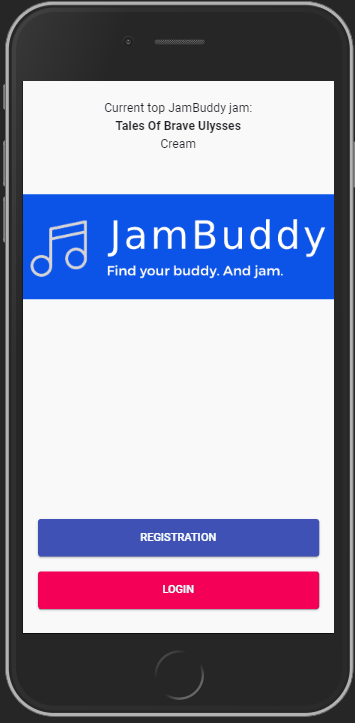
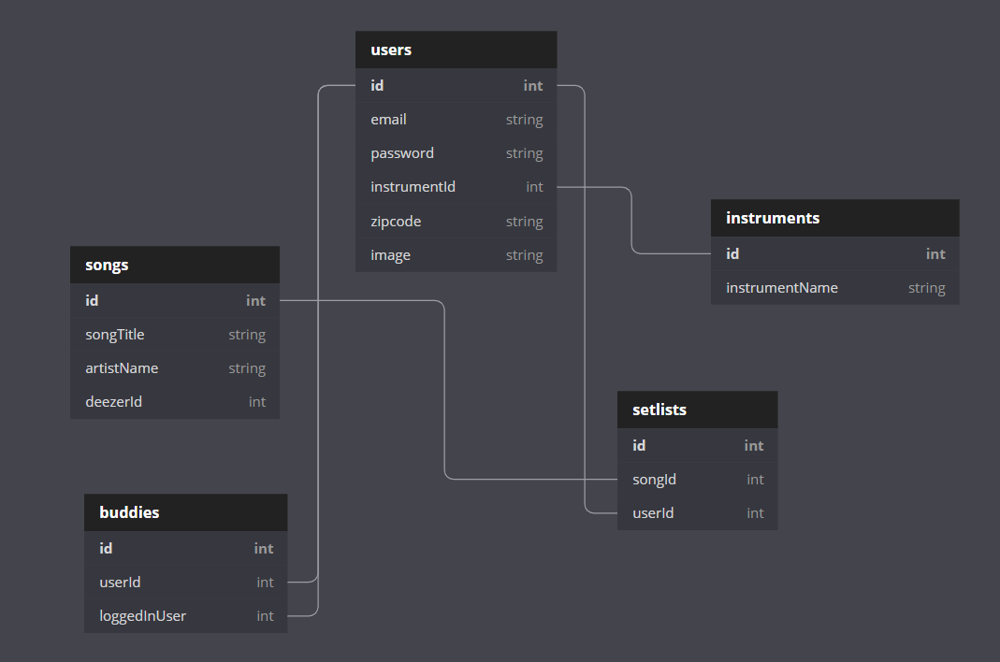

# JamBuddy
Find your buddy. And jam.

## What is JamBuddy?

JamBuddy is application that allows musicians to be matched with other musicians based on what songs they know how to play.

## Setup: Follow these steps exactly

1. Clone this repository
1. `cd` into the directory it creates
1. In the `api` directory, create a copy of the `database.json.example` and remove the .example extension.
1. Run `npm install` and wait for all dependencies to be installed.
1. Run `npm start` to verify that installation was successful.

## Running Your Server

1. Open another terminal window and navigate to the `api` folder within `src`
1. Run `json-server -p 5002 -w database.json`

## Using the App

1. In the browser, navigate to `localhost:3000`
1. Open your Developer Tools and toggle your device toolbar to on as JamBuddy is intended for mobile use.
1. If you have never used JamBuddy before, `Register` a new account
1. If you are a returning user, `Login` with your account information
1. Add songs you know how to play to your `setlist`. 
1. See what users know how to play the same songs as you in `matches` and add them to your `buddies`.
1. Check out the `buddies` page for a list of your added JamBuddies.

## ERD

---
&copy;2019 - Trey Suiter